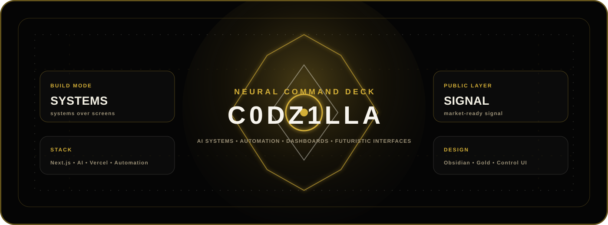
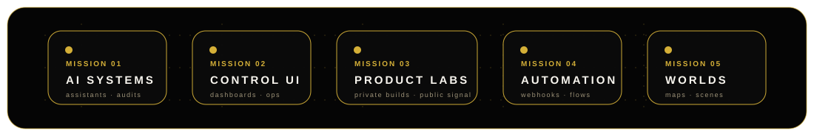
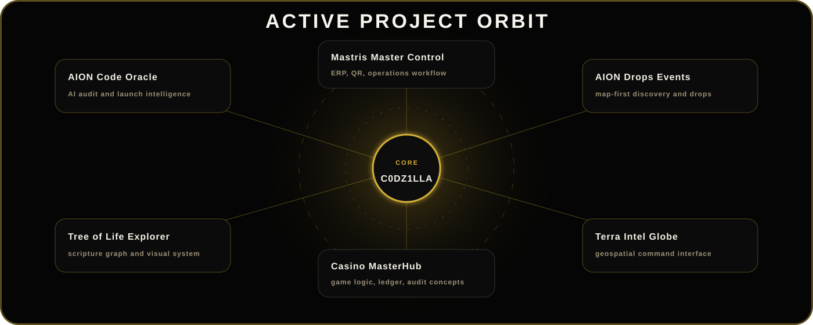
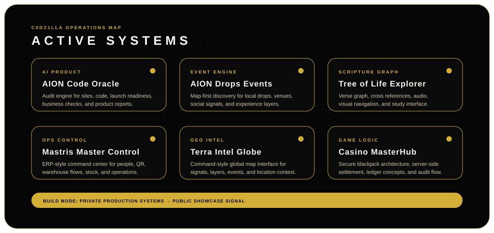
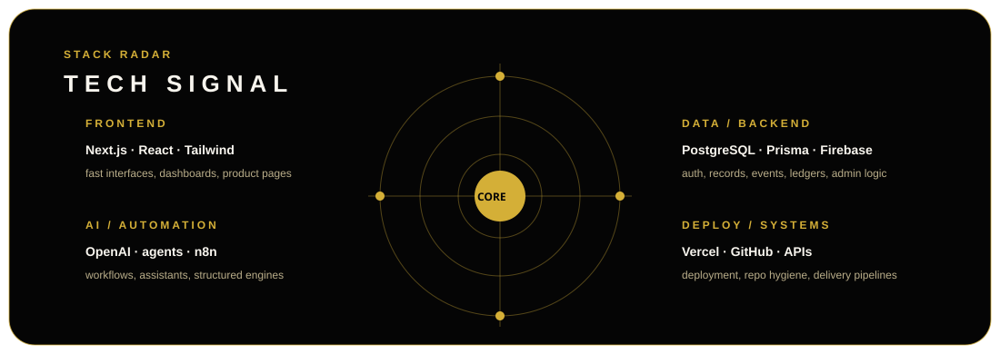

<!-- ============================================================= -->
<!-- C0DZ1LLA — GitHub Profile / Futuristic Builder Signal         -->
<!-- ============================================================= -->

<p align="center">
  
</p>

<p align="center">
  <a href="https://www.samanconnect.com/">
    
  </a>
  <a href="https://github.com/C0DZ1LLA">
    
  </a>
  
</p>

<p align="center">
  
</p>

<p align="center">
  
</p>

<p align="center">
  
</p>

---

## Core Signal

I build practical software systems with strong interfaces: AI tools, admin dashboards, automation flows, product backends, commerce logic, visual explorers, internal control rooms, and experimental interactive environments.

```txt
systems over noise
shipping over theory
interfaces with purpose
automation where it saves time
security before public exposure
```

<p align="center">
  
</p>

---

## Stack

<p align="center">
  
</p>

<p align="center">
  
  
  
  
  
  
</p>

---

## Build Zones

<table>
  <tr>
    <td width="50%">
      <h3>AI Product Systems</h3>
      <p>Audit engines, assistants, structured prompts, content pipelines, admin copilots, and business-facing intelligence layers.</p>
    </td>
    <td width="50%">
      <h3>Control Panels</h3>
      <p>Operational dashboards for products, staff, assets, orders, projects, warehouses, and internal workflows.</p>
    </td>
  </tr>
  <tr>
    <td width="50%">
      <h3>Automation Engines</h3>
      <p>Webhook chains, scheduled flows, API routing, notification systems, data movement, and repeatable logic.</p>
    </td>
    <td width="50%">
      <h3>Interactive Interfaces</h3>
      <p>Map systems, visual explorers, game-like dashboards, simulation layers, and cinematic UI experiments.</p>
    </td>
  </tr>
</table>

---

## Active Project Directions

<p align="center">
  
</p>

<p align="center">
  
</p>

<p align="center">
  
</p>

| System | Direction |
|---|---|
| **AION Code Oracle** | AI website, code, launch, and business audit reports |
| **AION Drops Events** | Map-first event discovery, drops, and local experience engine |
| **Tree of Life Explorer** | Scripture graph, verse, audio, and cross-reference visual system |
| **Mastris Master Control** | ERP-style operations, QR workflows, staff tools, warehouse logic |
| **Terra Intel Globe** | Geospatial intelligence dashboard and globe interface |
| **Casino MasterHub** | Secure game architecture, blackjack logic, ledger, and audit concepts |

---

## Repository Pulse

<!-- PROFILE-PULSE:START -->
<p align="center">
  
  
  
</p>

```txt
public repositories show the signal
private repositories hold the production systems
profile stays clean, visual, and safe
```
<!-- PROFILE-PULSE:END -->

---

## Public Visual Layer

<p align="center">
  
  
</p>

<p align="center">
  
</p>

---

## Achievement Layer

<p align="center">
  
</p>

---

## Operating Style

<details>
  <summary><b>Build protocol</b></summary>

```txt
01. understand the real workflow
02. design the system map
03. build the smallest working core
04. secure the private logic
05. polish the interface
06. deploy, test, improve
```

</details>

<details>
  <summary><b>Repository protocol</b></summary>

```txt
private repo  = source, secrets, production logic, admin logic
public repo   = showcase, docs, screenshots, safe demo, portfolio signal
profile repo  = identity layer, project direction, proof of build velocity
```

</details>

<details>
  <summary><b>Design language</b></summary>

```txt
obsidian base
gold signal
cyan telemetry
sharp hierarchy
cinematic but usable
```

</details>

---

## Connect

<p align="center">
  <a href="https://www.samanconnect.com/">
    
  </a>
  <a href="https://github.com/C0DZ1LLA">
    
  </a>
</p>

<p align="center">
  
</p>
